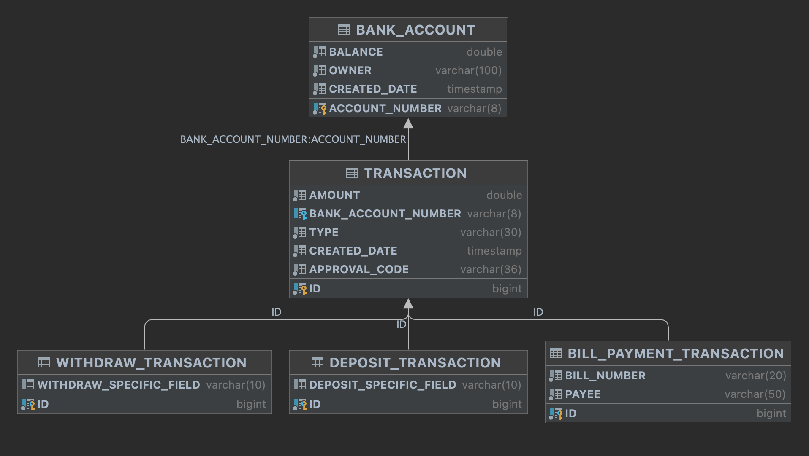
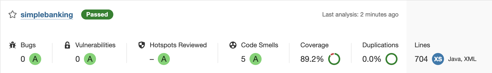

# SIMPLE BANKING

---
## Base Technologies
- Java 17
- Spring Boot 3
- JPA (Hibernate 6.2.0)
- Liquibase
- H2
- MySql
- JUnit5
- Mockito
- Lombok
- Swagger
- Maven
- Sonar
- TDD, DDD
---

## How to Run Application

**1 - Run With Docker Compose**<br>
* If you want to connect H2 Database; run `docker compose up` in the base path
* If you want to connect another database; open docker-compose file in the base path and activate the commented line (JAVA_OPTS). Then run `docker compose up` in the base path


**2 - Run With IDE or other tools (maven, java -jar)**<br>
* If you want to connect H2 Database; pass argument: `spring.profiles.active=h2` <br>
* If you want to connect another database; Pass arguments:<br>
`DATASOURCE_URL={DATASOURCE_URL}`<br>
`DATASOURCE_USERNAME={DATASOURCE_USERNAME}`<br>
`DATASOURCE_PASSWORD={DATASOURCE_PASSWORD}`<br>
`DATASOURCE_DRIVER_CLASS_NAME={DATASOURCE_DRIVER_CLASS_NAME}`<br>


**Note: The application tested with MySql and H2. So problems may occur with another databases.**

---
**Swagger UI:** http://localhost:8080/swagger-ui/index.html#/account-controller/credit


**H2 Console (If you use):** http://localhost:8080/h2-console
- **Username:** sa<br>
- **Password:** password<br>
- **JDBC URL:** jdbc:h2:mem:testdb<br>
- **Driver Class Name:** org.h2.Driver<br>
<br><br>
---

## Database Diagram


#### Default Data
| ACCOUNT_NUMBER | BALANCE | OWNER          | CREATED_DATE |
|----------------|---------|----------------|--------------|
| 111-1111       | 0       | Simple Banking | {generated}  |

---

## Sonar

If you want to review project with sonar, run this command in base path:
```
mvn clean verify sonar:sonar \                                                                                            
  -Dsonar.projectKey={sonar-project-key} \
  -Dsonar.host.url={sonar-url} \
  -Dsonar.login={sonar-token}
```
Also visit the link: https://docs.sonarqube.org/9.6/try-out-sonarqube/
<br>Last Sonar Report:
